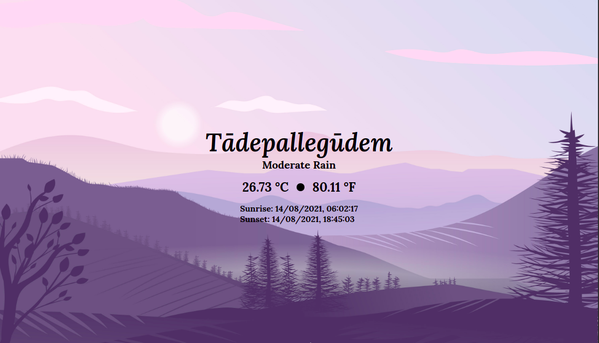

# Weather App
Search a location for forecast data.

> Follow along and learn 
core basics of the DOM,how to use fetch API, to call and get data from a third-party service and build a Weather App using [Open Weather Map](https://openweathermap.org/),which provides various weather data through API.

- get your own API keys and have fun experimenting around or use the [Live App](https://weatherapp.prilily.repl.co 
)

- Display Sunrise,Sunset data for a given location.
- Display data in metric or imperial units.

Feature ideas to implement.
- Display user location by default.

[Live App](https://weatherapp.prilily.repl.co 
)
